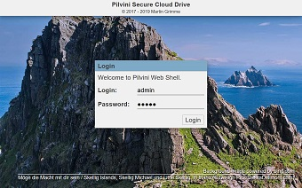
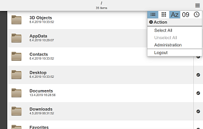
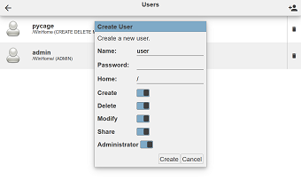
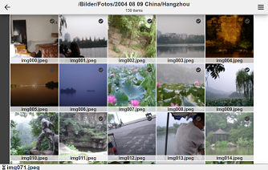

# pilvini
## X-Platform Personal Cloud Drive

> [Finnish]<br>
> **-ni** *(poss. suff.)* my ~<br>
> **pilvi** *(n.)* cloud<br>
> **pilvini** my cloud

*pilvini* is a cloud drive server implementing the WebDAV protoctol running on
Node.js and featuring a slick HTML5 web interface for easy access.

*pilvini* is there to make your home filesystem accessible to you worldwide in a
secure way and runs on whatever platform Node.js is running.


## Features:

 * WebDAV Server
   * SSL-encrypted communication and HTTP authentication
   * Multiple users with various permissions
   * Securely exposes a subdirectory on the host's filesystem
   * Virtual file system
     * Archives (ZIP) are handled transparently as directories
     * Recursively open archives inside archives

 * Full-featured HTML5 web shell
   * Designed for use on desktop, mobile, and TV screen
   * File operations (new file / directory, copy, rename, delete, upload, download)
   * Upload data by dragging files or directories from outside the browser window
   * Download directory hierarchies as ZIP files
   * Clipboard for moving / copying files
   * path breadcrumbs and favorites menu with bookmarked directories
   * Touchscreen gestures such as swipe back on mobile devices
   * Image preview and slideshow
   * Music playback
   * Video playback
   * File viewers for
     * text (with editing)
     * Markdown text (with editing)
     * PDF
     * image
     * video
     * VCard contacts
   * Preview thumbnails for images, videos, and music files with embedded cover art
   * Create and revoke password-protected directory shares

## Requirements:

 * Node.js
 * jszip
 * lwip image processing library (optional, if you want to see image thumbnails in the web interface)

## Installation

Put the `pilvini` directory wherever you like and enter the directory.

Run

```
# npm install
```

to install the package dependencies.

## First Setup

Start the server with
```
# node pilvini.js
```
and *pilvini* welcomes you with:
```
No configuration found. Using initial configuration.

                   | Version 0.2.0
   .-------.       |
  ( Pilvini ).--.  | (c) 2017 - 2019 Martin Grimme
 (  Cloud Drive  ) | https://github.com/pycage/pilvini
  ```````````````  |
Listening....      | Port 8000
```
Since you have not configured *pilvini* yet, it uses its built-in initial configuration.
Connect your webbrowser to port 8000 on the server where *pilvini* is running,
e.g.
```
http://localhost:8000/::shell/
```


By default, there is an administrator user created with login name `admin`
and password `admin`. Login and click the menu button in the top-right corner.



Select `Administration` from the menu to enter the administration interface.

Here you can change the server settings and create new users. It is highly recommended
to create a new user with `ADMIN` permission and delete the default user `admin`.



*pilvini* stores its configuration in the file `config.json` in its installation directory.

If you are giving other users access to *pilvini*, you should make sure that
none of them can access this directory. While the hashed passwords
cannot be used to reconstruct the password, it is possible to find a matching
string by brute-force or to construct one mathematically!

## Access via WebDAV

*pilvini* is a WebDAV server. Point your WebDAV client of choice to where *pilvini*
is listening for connections, e.g.:
```
https://pilvini.mydomain.org/index.html
```

### Known Issues with Windows Explorer and WebDAV

While Windows Explorer theoretically supports the WebDAV protocol for mounting
remote shares, it is in practise very picky.

 * It will not accept a WebDAV server with a self-signed SSL certificate,
   unless that certificate has been added to Windows' trust store manually.

 * It will not accept a WebDAV server over plain HTTP (no SSL) with the basic
   authentication method. Configure the server to use the digest method instead,
   or use SSL.

 * It is very chatty and moving the mouse cursor over folders can cause a lot of
   network traffic.

 * For every request, it has to be reminded to send the authentication header.
   As a consequence of this it sends every request twice. First unauthorized,
   then authorized.

## Access via the Web Shell



The web shell lets you access *pilvini* in a web browser, so you don't need a
WebDAV client.

Open the `/::shell/` document in a web browser supporting HTML5 (which is pretty much any recent browser), e.g.:
```
https://pilvini.mydomain.org/::shell/
```

### Navigation

Click on a directory item to enter that directory. Click on a file to open it. Some file types (e.g. images) are opened directly without leaving the shell. The other types are opened by the browser's default handler.

#### Back Button and Touch Gesture

If you can go up to the parent directory, a back button appears at the left of the top bar. Click to go to the parent directory.

On a touch screen you can also swipe the page to the right to go to the parent directoy.

#### Path Menu

Click on the path name in the top bar to open the path menu.

There you will find a list of breadcrumbs to quickly jump to any parent directory of the current path.

Click on the **Favorites** sub menu and select **Add to Favorites** to add the current directory to your list of favorites in this sub menu.

To remove an entry from the favorites list, select **Remove from Favorites**.

Directories in the favorite list are marked by a star symbol in the top bar.

Click on the **Shares Places** sub menu and select **Share This** to make the current directory quickly available to other people in read-only mode.

When sharing a directory, you will be asked for a login name and a password. People can the access the share by logging into the shell via these credentials.
```
https://<address>:<port>/::shell/
```

Select **Unshare This** to close the share.

Directories that are shared are marked by a folder symbol in the top bar.


### Actions

There is a menu button at the right of the top bar. Click on it to open the actions menu.

Some actions require you to select one or more files before. Click on the right edge checkmark of a file to select. Click again to unselect it. You can also choose **Select All** or **Unselect All** from the actions menu to select or unselect all items at once.

#### View Sub Menu

This sub menu provides options for changing the view mode (list view ord grid view) and the sort order (by name or by date) of the items.

#### New Sub Menu

This sub menu lets you create new directories or empty files in the current directory.

#### Clipboard Sub Menu

The clipboard is used for cutting, copying, and pasting files and directories.

To move a file from one directory to another, first select the file and choose the **Cut** option. Then navigate to the directory where you want to move the file to and choose the **Paste** option.

Choosing **Copy** instead of **Cut** creates a copy of the file instead of moving it.

Select the **Show** option to show the current content of the clipboard. The contents of the clipboard are remembered between sessions. You can even cut files on one device and continue pasting them on another device.

The clipboard's contents are replaced whenever you cut or copy files, and cleared when you paste.

#### Action Sub Menu

This sub menu provides file actions.

* **Upload** Upload a local file.
* **Download** Download the selected files or directories. Directories are downloaded as ZIP archives.
* **Rename** Rename the currently selected file or directory.
* **Delete** Delete the currently selected files or directories.

## Viewers

The shell supports a few file types to be viewed directly in the shell. Some file types can even be edited.

### Images

Clicking on an image file will open the image in a popup. Tap on the popup to dismiss it.

Use the left and right arrow keys on your keyboard or swipe the image to the left or right on a touch screen in order to browse through all images in the current directory.

### Text and Markdown-formatted Text

Text files (\*.txt) and Markdown files (\*.md) have an edit button in the viewer in the right of the top bar. Click on this button to switch between view mode and edit mode. Changes made in edit mode are saved automatically when switching back to the view mode or when leaving the viewer.

### PDF Documents

PDF documents are opened in a PDF viewer.

### VCard Documents

VCard documents containing contacts cards are opened in a VCard viewer. Editing is not supported yet.

### Music Files

When opening a music file, a music player will appear at the bottom of the shell page. Switching to other directories does not stop the music.

While the music player is active, click on other music files to put them in the playing queue.

The music player can be closed anytime by pressing the close button on the right.
